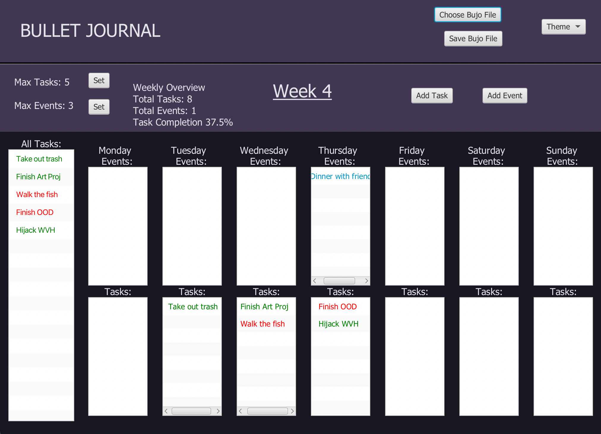
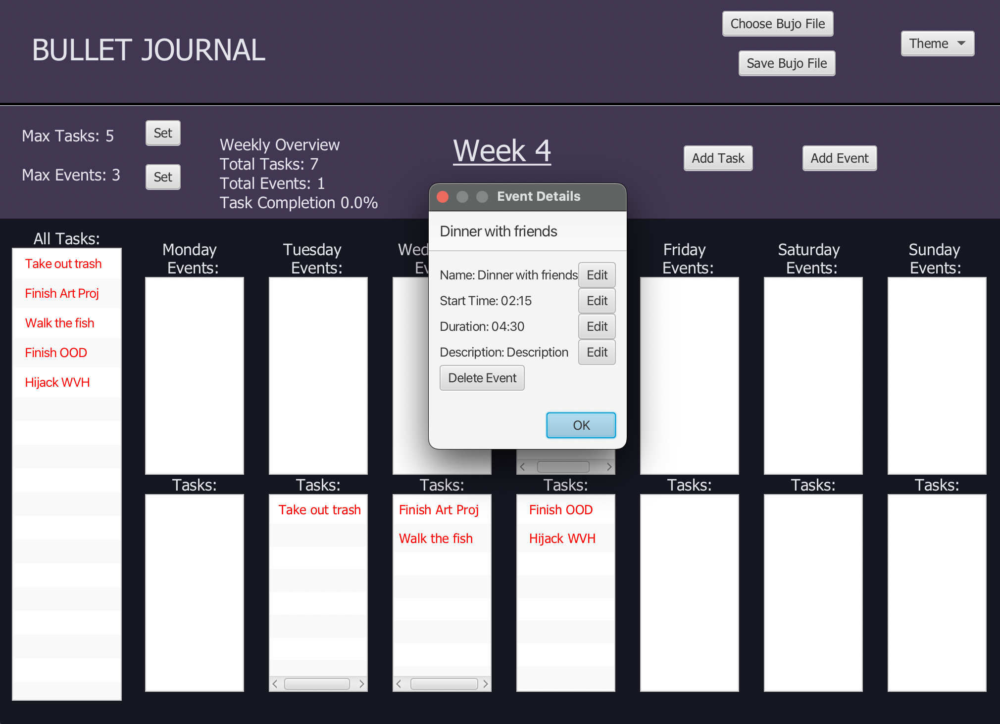
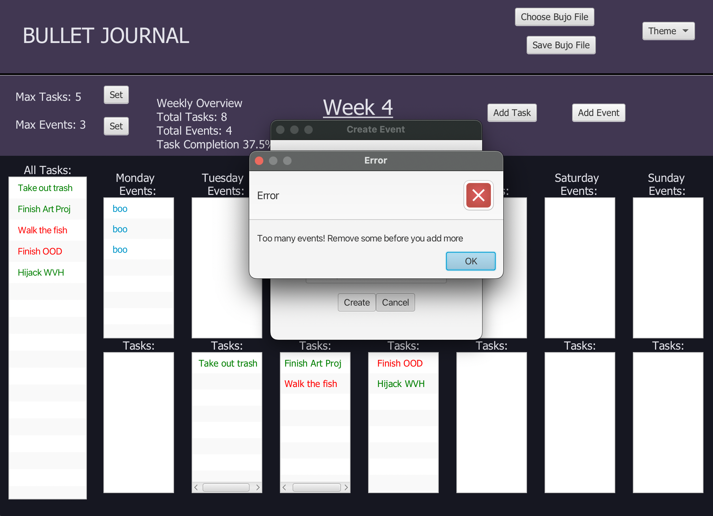
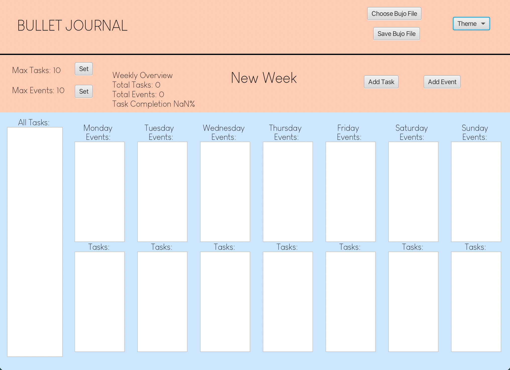

# Bullet Journal Organizational Tool

## About 
  Our Application is a digital version of a Bullet Journal for those who do not have the time to have and maintain a 
physical journal. Similar to a Bullet Journal, it has the basic functions of noting down all of your Tasks and Events 
for that week to help you keep track of your busy life. However, by digitalizing the journal, many more features have 
been implemented.
  
A feature which is only possible for a digital journal is a set amount of task and events which you can set for yourself 
and modify as felt necessary. Extra features which we have implemented for this journal are: 
 
<ul>
  <li>Themes & Customized Themes: The user can choose from our given themes or make their own theme which modifies
the font and colors of their Bullet Journal to fit their aesthetic needs</li>
<li>Task Queue: A sidebar to view all the tasks they need to do for that week</li>
<li>Mini Viewer: A way to view each individual task or event in more details</li>
<li>Take-backs: A to delete a task or event if it is no longer applicable</li>
<li>Mind Changes: A way to change the details for a task or event</li>
</ul>

## Images
 
Dark Theme, how it would look with tasks & events  

  
 
Mini Viewer  

  
 
Max Event Pop-up  

 
 
Custom Theme  

## SOLID Principles
 *Single Responsibility* 
Each of our class handles a separate task, called in by the main controller class BujoController. For example, each day 
in a week is handled separately as their own object, Day. Within a Day object, we also have separate Task and Event 
object which handles how they're created and how they interact within the program. For File reading and writing, they 
also have each of their own class with a static method which handles everything like serializing the records separated 
from the controller which only interact with the Viewer to get a path.   
*Open/Closed Principles* 
The Open/Closed Principle is exemplified in the JavaFxDialogue interface. By allowing users to create new classes that 
implement this interface, the principle ensures the extension of JavaFx with new features. All subclasses of 
JavaFxDialogue leverage its functionality to seamlessly interact within the graphical user interface (GUI).  
*Liskov Substitution Principle* 
Every Class which use an extension or implements another class does not break the higher-level class. An example of this
are the classes which makes use of the JsonDeserializer<T> for file saving. Each one of these classes makes use of the 
Deserializer class by implementing its method whilst returning the given Objected that can be switched. If there are 
more items to be stored, another Deserializer class can be added using this superclass for storing JsonRecord.  
*Interface Segregation Principle* 
The Interface Segregation Principle is demonstrated through separate interfaces for the Viewer and Controller. Each 
interface serves its specific function, with the Controller handling interactions between classes and the Viewer 
responsible for displaying everything. This is also true for the JavaFxDialogue interface which is only being used for
the JavaFx interactions in each class that implements it.  
*Dependency Inversion Principle*  
Aside from the individual objects which are pieces of the Bullet Journal (Day, Week, Task, Event, Theme), everything 
else in the program is depended on an interface or a superclass. These higher-level class are in noway affected by the
lower-level class as they are created with the same functionality and modified for extra extensions in the program for
different functionalities of features. 

## Ideas for the Future
Things which we could to add for future extensions
<ul>
<li>Quotes & Notes: Having this in would enhance the aesthetics of the Bullet Journal without too much modification
to the original product</li>
<li>Sort by Name & Location: This would be useful for the user as we already have a sidebar but sometimes looking at 
everything at once when it's unorganized can be overwhelming</li>
<li>Task Search: With the focus on clearing out tasks in mind, adding this feature can also help the user as they can
look for specific things they need to do in a long list</li>
  
</ul>

